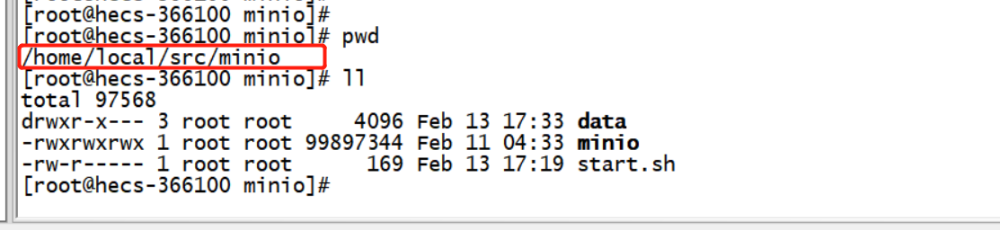
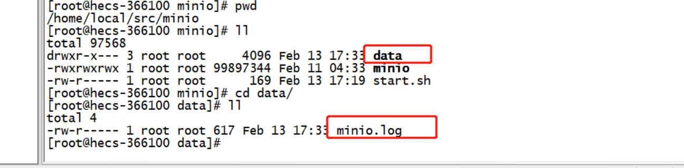
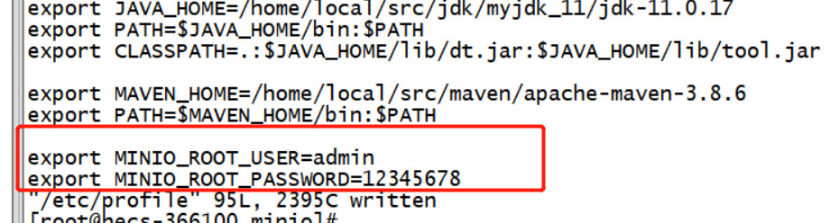
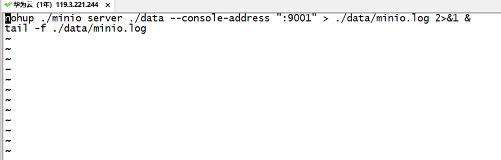

##第一步，创建minio文件夹

##第二步，wget下载安装包：
```
cd /minio
wget https://dl.minio.io/server/minio/release/linux-amd64/minio
```

##第三步，创建data文件夹及minio.log文件

##第四步，赋予minio文件执行权限
```
chmod 777 minio
```
##第五步，环境变量设置永久启动账号及密码
配置环境变量`vim /etc/profile`


```
#添加这俩参数即登录账号+密码
export MINIO_ROOT_USER=admin
export MINIO_ROOT_PASSWORD=12345678
```
环境变量配置完成后切记使用`source /etc/profile`刷新环境变量
##第六步，启动minio
添加启动脚本`start.sh`，`9001`为指定的访问端口号，启动日志输出到`./data/minio.log`文件内
```
nohup ./minio server ./data --console-address ":9001" > ./data/minio.log 2>&1 &
tail -f ./data/minio.log
```
