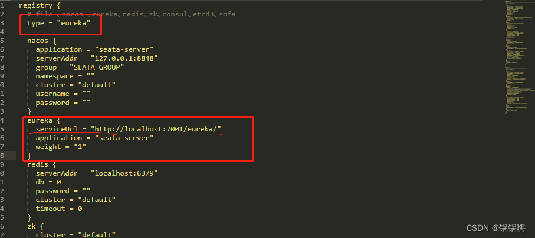
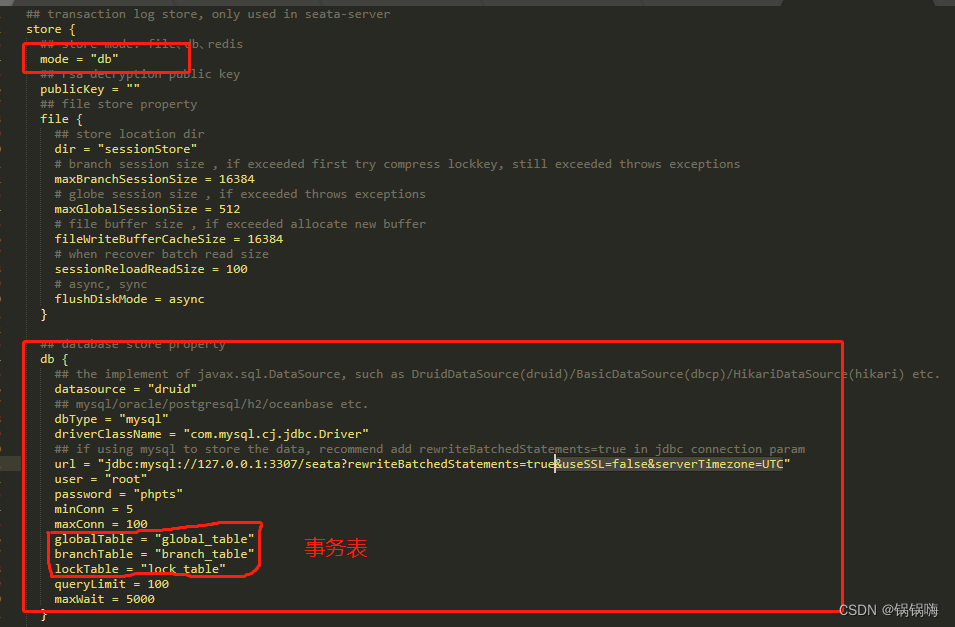
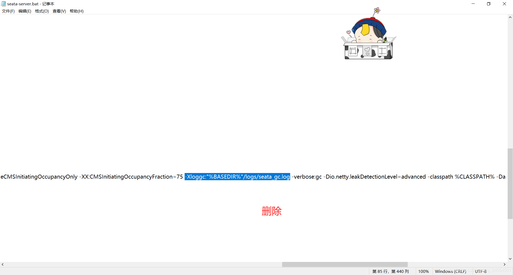

# springcloud+eureka+seata实现分布式事务处理

##seata-server的下载

<https://github.com/seata/seata/releases>

下载完后使用 tar -zxvf 压缩文件名.tar.gz 解压

##seata-server的配置文件
1. 编辑 `conf\registry.conf` 文件,注册中心是啥`type`就写啥


2. 编辑 `conf\file.conf` 文件


## seata-server启动命令
`sh ./bin/seata-server.sh` 打开eureka，发现已经注册上去了。

##seata-server数据表创建
因为seata-server在file.conf指定了db，所以需要在127.0.0.1:3306的seata库创建如下的表。
######全局事务表
```
DROP TABLE IF EXISTS `global_table`;
CREATE TABLE `global_table`  (
`xid` varchar(128) CHARACTER SET utf8 COLLATE utf8_general_ci NOT NULL,
`transaction_id` bigint(20) NULL DEFAULT NULL,
`status` tinyint(4) NOT NULL,
`application_id` varchar(32) CHARACTER SET utf8 COLLATE utf8_general_ci NULL DEFAULT NULL,
`transaction_service_group` varchar(32) CHARACTER SET utf8 COLLATE utf8_general_ci NULL DEFAULT NULL,
`transaction_name` varchar(128) CHARACTER SET utf8 COLLATE utf8_general_ci NULL DEFAULT NULL,
`timeout` int(11) NULL DEFAULT NULL,
`begin_time` bigint(20) NULL DEFAULT NULL,
`application_data` varchar(2000) CHARACTER SET utf8 COLLATE utf8_general_ci NULL DEFAULT NULL,
`gmt_create` datetime(0) NULL DEFAULT NULL,
`gmt_modified` datetime(0) NULL DEFAULT NULL,
PRIMARY KEY (`xid`) USING BTREE,
INDEX `idx_gmt_modified_status`(`gmt_modified`, `status`) USING BTREE,
INDEX `idx_transaction_id`(`transaction_id`) USING BTREE
) ENGINE = InnoDB CHARACTER SET = utf8 COLLATE = utf8_general_ci ROW_FORMAT = Dynamic;
SET FOREIGN_KEY_CHECKS = 1;
```

######分支事务表
```
DROP TABLE IF EXISTS `branch_table`;
CREATE TABLE `branch_table`  (
    `branch_id` bigint(20) NOT NULL,
    `xid` varchar(128) CHARACTER SET utf8 COLLATE utf8_general_ci NOT NULL,
    `transaction_id` bigint(20) NULL DEFAULT NULL,
    `resource_group_id` varchar(32) CHARACTER SET utf8 COLLATE utf8_general_ci NULL DEFAULT NULL,
    `resource_id` varchar(256) CHARACTER SET utf8 COLLATE utf8_general_ci NULL DEFAULT NULL,
    `branch_type` varchar(8) CHARACTER SET utf8 COLLATE utf8_general_ci NULL DEFAULT NULL,
    `status` tinyint(4) NULL DEFAULT NULL,
    `client_id` varchar(64) CHARACTER SET utf8 COLLATE utf8_general_ci NULL DEFAULT NULL,
    `application_data` varchar(2000) CHARACTER SET utf8 COLLATE utf8_general_ci NULL DEFAULT NULL,
    `gmt_create` datetime(6) NULL DEFAULT NULL,
    `gmt_modified` datetime(6) NULL DEFAULT NULL,
    PRIMARY KEY (`branch_id`) USING BTREE,
    INDEX `idx_xid`(`xid`) USING BTREE
    ) ENGINE = InnoDB CHARACTER SET = utf8 COLLATE = utf8_general_ci ROW_FORMAT = Dynamic;
SET FOREIGN_KEY_CHECKS = 1;
```

######锁表
```
DROP TABLE IF EXISTS `lock_table`;
CREATE TABLE `lock_table`  (
    `row_key` varchar(128) CHARACTER SET utf8 COLLATE utf8_general_ci NOT NULL,
    `xid` varchar(96) CHARACTER SET utf8 COLLATE utf8_general_ci NULL DEFAULT NULL,
    `transaction_id` bigint(20) NULL DEFAULT NULL,
    `branch_id` bigint(20) NOT NULL,
    `resource_id` varchar(256) CHARACTER SET utf8 COLLATE utf8_general_ci NULL DEFAULT NULL,
    `table_name` varchar(32) CHARACTER SET utf8 COLLATE utf8_general_ci NULL DEFAULT NULL,
    `pk` varchar(36) CHARACTER SET utf8 COLLATE utf8_general_ci NULL DEFAULT NULL,
    `gmt_create` datetime(0) NULL DEFAULT NULL,
    `gmt_modified` datetime(0) NULL DEFAULT NULL,
    PRIMARY KEY (`row_key`) USING BTREE,
    INDEX `idx_branch_id`(`branch_id`) USING BTREE
    ) ENGINE = InnoDB CHARACTER SET = utf8 COLLATE = utf8_general_ci ROW_FORMAT = Dynamic;
SET FOREIGN_KEY_CHECKS = 1;
```
##业务库的undo_log表
每一个业务都需要创建undo_log表。
```
CREATE TABLE `undo_log` (
    `id` bigint(20) NOT NULL AUTO_INCREMENT,
    `branch_id` bigint(20) NOT NULL,
    `xid` varchar(100) NOT NULL,
    `context` varchar(128) NOT NULL,
    `rollback_info` longblob NOT NULL,
    `log_status` int(11) NOT NULL,
    `log_created` datetime NOT NULL,
    `log_modified` datetime NOT NULL,
    `ext` varchar(100) DEFAULT NULL,
    PRIMARY KEY (`id`),
    UNIQUE KEY `ux_undo_log` (`xid`,`branch_id`)
) ENGINE=InnoDB AUTO_INCREMENT=1 DEFAULT CHARSET=utf8;
```


##服务调用者和被调用者pom加上
```
<dependency>
    <groupId>com.alibaba.cloud</groupId>
    <artifactId>spring-cloud-starter-alibaba-seata</artifactId>
    <version>2021.1</version>
</dependency>
```


##服务调用和被调用者都加上yml
```
seata:
  enabled: true
  application-id: ${spring.application.name}
  tx-service-group: seata-server
  # 是否自动开启数据源代理
  enable-auto-data-source-proxy: true
  # 数据源代理模式，使用AT模式
  data-source-proxy-mode: AT
  service:
    # 事务群组
    vgroupMapping:
      seata-server: default  # default 的值为集群的名字，在配置 seata service 的时候指定的
    grouplist:
      default: 119.3.221.244:8091
    enable-degrade: false
    # 全局事务开关
    disable-global-transaction: false
  config:
    type: file
    file:
      name: file.conf
  registry:
    type: file
    file:
      name: file
```

##在service的方法上添加注解
@GlobalTransactional(name = "seata-server", rollbackFor = Exception.class)

##seata-server报错问题
1. JDK11版本下启动seata之后，报错如下:
`Initialization of output ‘file=xxxlogs/seata_gc.log‘ using options ‘(null)‘ failed.`

修改bat或者sh文件即可


2. 在分布式全局事务执行失败进行全局回滚时，需要通过Seata 的 undoLog回滚的服务会出现报错信息。  
`Seata json decode exception, Cannot construct instance of java.time.LocalDateTime`  
Seata 默认采用的序列化方式是 jackson，报错信息显示jackson 反序列化失败。以protostuff 自定义Seata undo_log序列化。  
可以查看  <https://blog.csdn.net/Saintmm/article/details/126182178>

pom文件:
```
  <!-- 解决seata LocalDateTime序列化问题，配合配置文件seata.client.undo.log-serialization=protostuff 使用 -->
        <dependency>
            <groupId>io.protostuff</groupId>
            <artifactId>protostuff-core</artifactId>
            <version>1.6.0</version>
        </dependency>
        <dependency>
            <groupId>io.protostuff</groupId>
            <artifactId>protostuff-runtime</artifactId>
            <version>1.6.0</version>
        </dependency>
```
配置文件:
```
seata:
    client:
        undo:
          #指定undo的序列化协议为protostuff
          log-serialization: protostuff
```


### 通过docker部署seataServe  https://blog.csdn.net/ctwy291314/article/details/130749803

docker 安装的1.6.1版本seata
-- -------------------------------- The script used when storeMode is 'db' --------------------------------
-- the table to store GlobalSession data
CREATE TABLE IF NOT EXISTS `global_table`
(
    `xid`                       VARCHAR(128) NOT NULL,
    `transaction_id`            BIGINT,
    `status`                    TINYINT      NOT NULL,
    `application_id`            VARCHAR(32),
    `transaction_service_group` VARCHAR(32),
    `transaction_name`          VARCHAR(128),
    `timeout`                   INT,
    `begin_time`                BIGINT,
    `application_data`          VARCHAR(2000),
    `gmt_create`                DATETIME,
    `gmt_modified`              DATETIME,
    PRIMARY KEY (`xid`),
    KEY `idx_status_gmt_modified` (`status` , `gmt_modified`),
    KEY `idx_transaction_id` (`transaction_id`)
) ENGINE = InnoDB
  DEFAULT CHARSET = utf8mb4;

-- the table to store BranchSession data
CREATE TABLE IF NOT EXISTS `branch_table`
(
    `branch_id`         BIGINT       NOT NULL,
    `xid`               VARCHAR(128) NOT NULL,
    `transaction_id`    BIGINT,
    `resource_group_id` VARCHAR(32),
    `resource_id`       VARCHAR(256),
    `branch_type`       VARCHAR(8),
    `status`            TINYINT,
    `client_id`         VARCHAR(64),
    `application_data`  VARCHAR(2000),
    `gmt_create`        DATETIME(6),
    `gmt_modified`      DATETIME(6),
    PRIMARY KEY (`branch_id`),
    KEY `idx_xid` (`xid`)
) ENGINE = InnoDB
  DEFAULT CHARSET = utf8mb4;

-- the table to store lock data
CREATE TABLE IF NOT EXISTS `lock_table`
(
    `row_key`        VARCHAR(128) NOT NULL,
    `xid`            VARCHAR(128),
    `transaction_id` BIGINT,
    `branch_id`      BIGINT       NOT NULL,
    `resource_id`    VARCHAR(256),
    `table_name`     VARCHAR(32),
    `pk`             VARCHAR(36),
    `status`         TINYINT      NOT NULL DEFAULT '0' COMMENT '0:locked ,1:rollbacking',
    `gmt_create`     DATETIME,
    `gmt_modified`   DATETIME,
    PRIMARY KEY (`row_key`),
    KEY `idx_status` (`status`),
    KEY `idx_branch_id` (`branch_id`),
    KEY `idx_xid` (`xid`)
) ENGINE = InnoDB
  DEFAULT CHARSET = utf8mb4;

CREATE TABLE IF NOT EXISTS `distributed_lock`
(
    `lock_key`       CHAR(20) NOT NULL,
    `lock_value`     VARCHAR(20) NOT NULL,
    `expire`         BIGINT,
    primary key (`lock_key`)
) ENGINE = InnoDB
  DEFAULT CHARSET = utf8mb4;

INSERT INTO `distributed_lock` (lock_key, lock_value, expire) VALUES ('AsyncCommitting', ' ', 0);
INSERT INTO `distributed_lock` (lock_key, lock_value, expire) VALUES ('RetryCommitting', ' ', 0);
INSERT INTO `distributed_lock` (lock_key, lock_value, expire) VALUES ('RetryRollbacking', ' ', 0);
INSERT INTO `distributed_lock` (lock_key, lock_value, expire) VALUES ('TxTimeoutCheck', ' ', 0);
